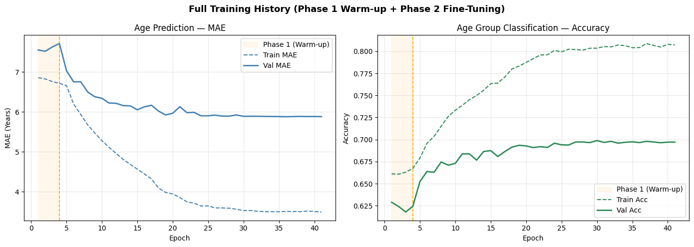
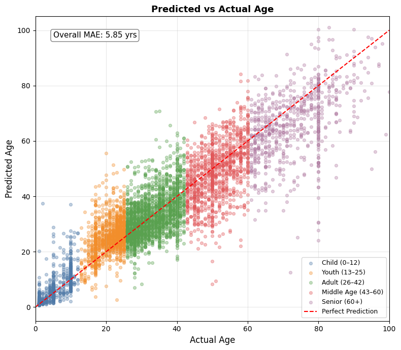

# Age Prediction from Facial Images

A deep learning CNN pipeline that predicts a person's **exact age** and **age group** from facial images, using transfer learning with EfficientNetB0 and YOLO-based face detection.

- **Age Regression** — predict the exact age (in years)
- **Age Group Classification** — classify into 5 groups: Child (0–12), Youth (13–25), Adult (26–42), Middle Age (43–60), Senior (60+)

The dual-output design (multi-task learning) improves accuracy — the classification head acts as an anchor that guides the regression head toward the correct age range.

## Public Datasets

| Source | Images |
|--------|--------|
| B3FD (Biometrically Filtered Famous Figures) | 33,873 |
| UTKFace | 23,705 |
| Adience | 16,358 |
| FGNET | 1,002 |

**Balancing strategy:**
- Ages capped at 100
- Rare ages (<10 images) upsampled via augmentation (rotation, flip, zoom, brightness shifts)
- Overrepresented ages downsampled to 2,000 images per age, preserving source ratios

---

## Pipeline
```
Raw Images → YOLO Face Detection & Cropping → 224×224 Resize → tf.data Pipeline → Model
```

1. **Face Detection** — YOLOv8-Face (`face_yolov8n.pt`) crops the largest detected face with a 15% bounding box margin
2. **Preprocessing** — Images saved as uint8 [0–255], normalised to [0, 1] inside the tf.data pipeline
3. **Train / Val / Test Split** — 80% / 10% / 10%, stratified by age group

---

## Model Architecture

**Transfer Learning with EfficientNetB0** (pre-trained on ImageNet)
```
Input (224×224×3)
    → Rescaling (→ [0, 255] for EfficientNet)
    → EfficientNetB0 Backbone (frozen in Phase 1, partially unfrozen in Phase 2)
    → GlobalAveragePooling2D
    → Dense(512, ReLU) + Dropout(0.3)
    → ┌─ Age Group Output  (Softmax, 5 classes)
       └─ Age Output        (Linear, 1 unit)
```

**Hyperparameters** (found via Keras Tuner — Hyperband, 2 iterations):
- Dense units: 512
- Dropout rate: 0.3
- Initial learning rate: 1e-3

---

## Training Strategy

Training was done in **two phases** to protect pre-trained ImageNet weights:

**Phase 1 — Warm-up (7 epochs)**
- Backbone fully frozen — only custom heads train
- LR: `5e-4` — slightly lower than tuner LR since heads are already partially trained
- EarlyStopping (patience=2) and ModelCheckpoint active
- Goal: stabilise the heads before touching the backbone

**Phase 2 — Fine-tuning (up to 55 epochs, stopped at 37)**
- Top 80 layers of EfficientNetB0 unfrozen
- BatchNorm layers kept frozen throughout
- LR: `3e-5` — tiny steps to avoid destroying pre-trained weights
- EarlyStopping (patience=5), ReduceLROnPlateau, ModelCheckpoint active
- Best weights restored from epoch 32

Training monitored in real time via **Weights & Biases**.

---

## Results

| Metric | Phase 1 (Warm-up) | Phase 2 (Fine-tuning) |
|--------|-------------------|----------------------|
| Best Val MAE | 7.51 years | **5.88 years** |
| Age Group Accuracy | ~60% | **~89–90%** |

**Improvement over v1 (scratch CNN):**
- Val MAE dropped from ~9+ → ~5.88 years
- Age group accuracy improved from ~86% → ~89–90%
- Smoother validation curves with smaller train/val gap




---

## Tech Stack

`Python` · `TensorFlow / Keras` · `YOLOv8 (Ultralytics)` · `OpenCV` · `Keras Tuner (Hyperband)` · `Weights & Biases` · `Pandas` · `NumPy`

## ⚠️ Critical Mistake & Fix

During preprocessing, `crop_face_with_yolo()` was originally normalising pixel values to `[0, 1]` **before** saving with `cv2.imwrite()`:
```python
# ❌ WRONG — dividing by 255 before saving
face_rgb = face_rgb.astype("float32") / 255.0
cv2.imwrite(str(save_path), face_bgr)  # saves near-black images
```

`cv2.imwrite()` expects uint8 values in the range [0, 255]. Passing float values between 0 and 1 causes OpenCV to clamp everything to 0 — saving essentially black images to disk. The `tf.data` pipeline then loaded these black images and normalised them again (`/ 255.0`), giving the model near-zero pixel values to train on.

**Symptom:** Validation MAE was stuck at ~14–15 from epoch 1 and barely moved across 30+ epochs, with training and validation MAE nearly identical — a sign the model wasn't learning anything meaningful.

**Fix:** Return raw uint8 from the crop function and let the pipeline handle normalisation:
```python
# ✅ CORRECT — return uint8, normalise later in tf.data
face_rgb = cv2.resize(face_rgb, target_size, interpolation=cv2.INTER_AREA)
return face_rgb  # dtype: uint8, range: [0, 255]
```

After this fix, epoch 1 MAE dropped to ~8.3 and continued improving — confirming the pipeline was finally working correctly.

---