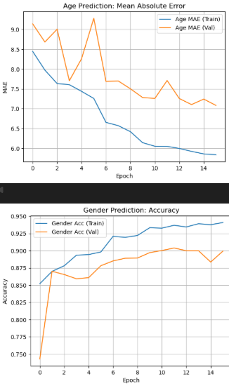

# 🧠 Age and Gender Prediction using CNN

This project is a beginner-friendly deep learning exploration where I, a complete **CNN virgin**, attempt to learn and implement a **multi-task Convolutional Neural Network (CNN)** to predict both **age (regression)** and **gender (classification)** from facial images.

---

## 🌐 Deployment: Try it Live

I deployed my trained model as an interactive web application using **Streamlit**. You can try it out here:

### 👉 [Live App on Streamlit](https://killuasmurf-age-gender-predictor.streamlit.app/)

---

## 📁 Dataset

The dataset used is the [UTKFace facial dataset from Kaggle](https://www.kaggle.com/datasets/jangedoo/utkface-new), which contains over 20,000 face images labeled with:

- Age
- Gender
- Race
- Timestamp

Filename format: `age_gender_race_timestamp.jpg`

---

## 🛠 Tools and Libraries

- `TensorFlow / Keras`
- `NumPy`, `Pandas`
- `Matplotlib`, `Seaborn`
- `scikit-learn`
- `ImageDataGenerator` for augmentation

---

## 🧪 What I Did (Step-by-Step)

This notebook is structured into **13 logical steps**, starting from dataset loading and ending in evaluation.


### 1. Load Dataset
Parsed filenames and extracted age and gender into a DataFrame.

### 2. Data Preprocessing
Cleansed the data, ensured valid entries, and converted gender to categorical.

### 3. Balancing Dataset
Manually upsampled underrepresented ages (91, 94, 97, 98) using image augmentation. Downsampled dominant classes (1 and 26) to reduce bias.

### 4. Split into Response and Predictor
Defined `X` as image data and `y` as output labels (age and gender).

### 5. Convert Gender to Binary Categories
Used one-hot encoding to convert gender for classification use.

### 6. Build the CNN Model
Built a custom CNN with multiple Conv2D, MaxPooling, Dropout, and Flatten layers. Separate output heads for:
- Age (Dense 1) → regression
- Gender (Dense 2 + softmax) → classification

### 7. Compile the Model
Used `adam` optimizer with:
- `mse` loss for age
- `categorical_crossentropy` loss for gender
- `mae` and `accuracy` as metrics

### 8. Train the Model
Trained for 15 epochs on the processed dataset. Used validation split and monitored both tasks during training.

### 9. Plotting Training History
Plotted:
- Age MAE over epochs
- Gender accuracy over epochs

### 10. Age Prediction Evaluation
Plotted actual vs predicted ages. Clear positive trend near ideal prediction line.

### 11. Gender Prediction Evaluation
Generated classification report with precision, recall, and F1 for male/female.

### 12. Final Evaluation
Used `model.evaluate()` on test data to compute total loss, individual losses, and metrics.

### 13. Insights
Summarized training performance and potential improvements (e.g., clamping negative age predictions, enhancing balance in age extremes).


---

Age and Gender Prediction

```python
# import libraries
import pandas as pd
import numpy as np  
import matplotlib.pyplot as plt
import seaborn as sns
import os
from pathlib import Path
from PIL import Image
import warnings

# import tensorflow and keras
import tensorflow as tf
import keras
from keras import layers, models
from tensorflow.keras.preprocessing.image import ImageDataGenerator
from keras.preprocessing.image import img_to_array, load_img, array_to_img
from sklearn.model_selection import train_test_split
from keras.initializers import random_uniform, glorot_uniform, constant, identity
from keras.layers import Dropout, Input, Add, Dense, Activation,\
    BatchNormalization, Flatten, Conv2D, MaxPooling2D, GlobalMaxPooling2D
from keras.models import Model, Sequential, load_model
print(dir(keras))
```

### 1. Load Dataset


```python
# Path to the UTKFace dataset
dataset_path = Path("UTKFace")

# Get all image filenames
image_files = [f for f in os.listdir(dataset_path) if f.endswith('.jpg')]
print(f"Total images found: {len(image_files)}")
```

Format is given as ` _age_gender_race_timestamp.jpg `

We iterate over all image files in dataset, and add to df Dataframe with columns:
- `image_path`
- `age`
- `gender`

```python
age, gender, image_path = [], [], []

for file in image_files:
        
    split = file.split('_')
    if len(split) == 4:
        image_path.append(Path(dataset_path) / file)
        age.append(int(split[0]))
        gender.append(int(split[1]))
    else:
        continue
    
# Create a DataFrame
df = pd.DataFrame({
    'image_path': image_path,
    'age': age,
    'gender' : gender})

df.head()
```

### 2. Data Preprocessing

```python
df.info()
```

*Convert gender to Male and Female labels/categories*

remember to comment out the labelling process so it wont convert again

```python
# df['gender'] = df['gender'].map({0: 'Male', 1: 'Female'})

df['gender'] = df['gender'].astype('category')

df['gender'].value_counts()
```

```python
sns.histplot(data = df, x = age)
```

Gender Distribution is quite balanced. However, the age distribution is highly imbalanced and heavily skewed towards younger individuals. The histogram reveals a significant peak of data points in the 20-30 year-old range, representing the majority of the dataset. This data imbalance is a critical factor that needs to be addressed before training the CNN model.

**Impact on the CNN Model:**

The model is highly likely to become biased towards the heavily represented age groups (e.g., 20s and 30s). This will lead to excellent prediction accuracy for these ages but poor generalization and significant performance degradation on underrepresented age groups, particularly for older individuals. The model will struggle to accurately predict the age of individuals in these categories, often defaulting to a more common age from the training set.

Hence, it is crucial to implement data balancing techniques such as oversampling the minority classes, undersampling the majority classes, or using weighted loss functions during model training.

### 3. Balancing Dataset

To ensure better model generalization and avoid bias toward certain age groups, we apply two techniques to balance the dataset:

1. **Age Capping**: Ages greater than 100 are capped at 100. This simplifies rare outliers and allows the model to generalize better without being skewed by very high ages.

2. **Class Balancing (Age Distribution)**: We analyze the distribution of age labels and perform class balancing:
   - **Upsample** underrepresented age groups (rare ages with few samples).
   - **Downsample** overrepresented age groups (common ages with too many samples).
   - This helps prevent the model from overfitting to frequent ages and improves performance on rare ones.

```python
# put those with age >= 100 as just 100
df['age'] = df['age'].apply(lambda x: 100 if x >= 100 else x)
# Step 1 is done!

age_counts = df['age'].value_counts().sort_values()
for i in range(100):
    if i not in age_counts.index:
        print(i)
print(age_counts)
```

##### I will need to find images for 94, 97, 98 and upsample for ages 91, 94, 97, 98 until there are 5 samples each. And then downsample ages 1 and 26 to just 1k images, in order to balance the age distribution.

```python
new_rows = pd.DataFrame({
    'age': [94, 97, 98],
    'image_path': [Path('UTKFace_augmented/age_94_lady.jpg'), Path('UTKFace_augmented/age_97_lady.jpg'), Path('UTKFace_augmented/age_97_lady.jpg')],
    'gender': [1, 1, 1]
})

df = pd.concat([df, new_rows], ignore_index=True, sort=False)

#check if the new rows are added
df.tail()
```

```python
#### Upsampling
```

```python
# Image Augmentation Strategy
datagen = ImageDataGenerator(
    rotation_range=20,  # Randomly rotate images in the range (degrees, 0 to 180)
    width_shift_range=0.1,  # Randomly translate images horizontally (fraction of total width)
    height_shift_range=0.1,  # Randomly translate images vertically (fraction of total height)
    brightness_range=[0.8, 1.2],  # Randomly change brightness
    shear_range=0.1,  # Shear angle in counter-clockwise direction in degrees
    zoom_range=0.1, # Randomly zoom in on images
    horizontal_flip=True,  # Randomly flip images horizontally
    fill_mode='nearest'
)
```

```python
# Create a folder for augmented images, comment out after creating it
# to avoid re-creating it every time
augmented_path = Path("UTKFace_augmented")
# augmented_path.mkdir(exist_ok=True)
```

```python
target_ages = [91, 94, 97, 98]
image_size = (200, 200)

subset = df[df['age'].isin(target_ages)]
print(subset)
```

```python
for index, row in subset.iterrows():
    # Construct the full image path
    if 'chip' in str(row.image_path):
        original_img_path = Path(f"{row.image_path}")
    else:
        original_img_path = Path(f"{row.image_path}")

    try:
        # Load the image
        img = Image.open(original_img_path)
        # Convert to NumPy array and expand dimensions to create a batch (1, height, width, channels)
        # ImageDataGenerator expects a batch of images, even if it's just one
        img_array = np.array(img)
        img_array = np.expand_dims(img_array, axis=0) # Add batch dimension

        i = 0
        # ➤ Starts generating new augmented versions of your original image — one at a time (batch_size=1).
        # Use .flow() with the image array
        for batch in datagen.flow(img_array, batch_size=1):
            # 'batch' will be a NumPy array of shape (1, height, width, channels)
            # Extract the single augmented image from the batch
            augmented_image_array = batch[0]
            
            # Convert the NumPy array back to a PIL Image
            augmented_image = array_to_img(augmented_image_array)
            
            # Save the augmented image
            augmented_image_path = augmented_path / f"{row.age}_{row.gender}_{i}.jpg"
            augmented_image.save(augmented_image_path)
            print(f"Saved augmented image: {augmented_image_path}")
            
            # Increment the counter
            i += 1
            if i >= 5:  # Save 5 augmented images per original image
                break
    except Exception as e:
        print(f"Error processing {original_img_path}: {e}")
        continue
```

```python
# Get all augmented image files
augmented_files = [f for f in os.listdir(augmented_path) if f.endswith('.jpg') and not f.startswith('age')]

# Extract age and gender from filename
augmented_data = []
for file in augmented_files:
    parts = file.split('_')
    if len(parts) >= 3:
        age = int(parts[0])
        gender = int(parts[1])
        image_path = augmented_path / file
        augmented_data.append({'image_path': image_path, 'age': age, 'gender': gender})

# Create DataFrame
df_upsampled = pd.DataFrame(augmented_data)

# Combine with original DataFrame
df = pd.concat([df, df_upsampled], ignore_index=True)

# Check the last 26 rows
df.tail(26)
```

#### Downsampling

```python
# Randomly downsample ages 1 and 26 to just 1k images each, removing 123 images from age 1, and 1197 images from age 26
df_downsampled = df.copy()
age_1 = df_downsampled[df_downsampled['age'] == 1]
age_26 = df_downsampled[df_downsampled['age'] == 26]
age_1_downsampled = age_1.sample(n=1000, random_state=42)
age_26_downsampled = age_26.sample(n=1000, random_state=42)

# Step 3: Filter out the original age 1 and age 26 rows from the main DataFrame
# Use .isin() with a list for multiple conditions and ~ for negation
df_other_ages = df_downsampled[~df_downsampled['age'].isin([1, 26])]

# Step 4: Concatenate the downsampled ages with the rest of the DataFrame
# Assuming 'subset' is another DataFrame you want to include.
# If 'subset' is not relevant to this specific downsampling task, remove it.
df_meow = pd.concat([df_other_ages, age_1_downsampled, age_26_downsampled])

# Optional: Verify the new counts
df_meow['age'].value_counts().sort_values()
```

```python
sns.histplot(data = df_meow['age'])
```

##### *Data is definitely more balanced than before.*

```python
# check if all rows are of Path Type for image_path column

all_paths = df_meow['image_path'].apply(lambda x: isinstance(x, Path)).all()
print("All image paths are Path objects?" , all_paths)
```

### 4. Split into response and predictor

##### X as predictor(images), y as response(age and gender)

`img_array = img_to_array(img) / 255.0` ->  Converts the image into a NumPy array of pixel values, then divides all values by 255.0. This way, pixel values are within [0, 1] range.

This helps model train better and faster, by standardising + changing from *Python List* to **Numpy Array**

```python
image_size = (200, 200)
X = []
y_age = []
y_gender = []

for idx, row in df_meow.iterrows():
    try:
        img_path = row['image_path']
        img = load_img(img_path, target_size=image_size)
        img_array = img_to_array(img) / 255.0  # Normalize
        X.append(img_array)
        y_age.append(row['age'])
        y_gender.append(row['gender'])
    except Exception as e:
        print(f"Failed to process {str(img_path)}: {e}") # type: ignore

X = np.array(X)
y_age = np.array(y_age)
y_gender = np.array(y_gender)
```

### Train-test split

```python
X_train, X_test, y_age_train, y_age_test, y_gender_train, y_gender_test = train_test_split(
    X, y_age, y_gender, test_size=0.2, random_state=42
)
```

```python
print(X_train.shape)      
# (batch_size, height, width, channels(RGB))   
print(y_age_train.shape)    
print(y_gender_train.shape)
```

#### 5. Convert gender to binary categories

```python
y_gender_train = tf.keras.utils.to_categorical(y_gender_train, num_classes=2)
y_gender_test = tf.keras.utils.to_categorical(y_gender_test, num_classes=2)
```

#### 6. Build the CNN model

For each convolution + pooling blocks, 
##### **Conv2D(32) → MaxPool → Conv2D(64) → MaxPool → Conv2D(128) → MaxPool**
1) Use 32/64/128 filters of size 3x3 to detect features eg.edges, textures. Increase so that model learns more complex features.
2) Use `padding = same` to add zero around edges of the image, so that output has same width and height as input
3) Normalisation -> **after** `Conv2D` layers and **before** `activation`, to speed up training + reduce overfitting
4) `activation='relu` prevents vanishing gradient problem
- Vanishing gradient happens when the learning vanishes. In deep networks, as you go backward during training (via backpropagation), gradients can get smaller and smaller (approaching zero). Eventually, the early layers stop learning — because the gradient is nearly zero, so no weight updates happen.
5) reduce size with `MaxPooling2D`, keeping important info while shrinking the image
6) `Flatten` converts the 2D output into 1D so it can go into a regular dense layer
7) `Dropout(0.5)` randomly turns off 50% of the neurons during training to prevent overfitting

```python
from tensorflow.keras.models import Model
from tensorflow.keras.layers import Input, Conv2D, MaxPooling2D, Flatten, Dense, Dropout, BatchNormalization

input_layer = Input(shape=(200, 200, 3))

x = Conv2D(32, (3,3), padding='same')(input_layer)
x = BatchNormalization()(x)
x = Activation('relu')(x)
x = MaxPooling2D(2,2)(x)

x = Conv2D(64, (3,3), padding='same')(x)
x = BatchNormalization()(x)
x = Activation('relu')(x)
x = MaxPooling2D(2,2)(x)

x = Conv2D(128, (3,3), padding='same')(x)
x = BatchNormalization()(x)
x = Activation('relu')(x)
x = MaxPooling2D(2,2)(x)

x = Flatten()(x)
x = Dropout(0.5)(x)

age_output = Dense(1, name='age_output')(x)                             
gender_output = Dense(2, activation='softmax', name='gender_output')(x)  
# Dense(2) = Creates 2 output neurons (one for each gender)
# activation= 'softmax' -> Converts raw numbers into probabilities that sum to 1

model = Model(inputs=input_layer, outputs=[age_output, gender_output])
```

#### 7. Compile the model

> _It prepares your model for training by telling it:_
1) _How to learn (optimizer)_   = I use `adam` since it is the best choice for beginners and most practical models
2) _What to measure (metrics)_ 
3) _What to minimize (loss function)_

```python
model.compile(
    optimizer='adam',
    loss={
        'age_output': 'mse',          # mean squared error for age regression, MSE works best with gradient-based learning 
        'gender_output': 'categorical_crossentropy'  # for gender classification
    },
    metrics={
        'age_output': 'mae',          # mean absolute error, measures average difference between predicted and true age.
        'gender_output': 'accuracy'
    }
)
```

#### 8. Train the model

I will be using 10% of the training data to validate the model after each epoch. 

The model updates its weights once per image per epoch.
Batch size = 32, so processing and updating of weights are done in batches, hence faster.

> *Tensorflow auto calculates the loss (how wrong a model is), then uses backpropagation to compute gradients (tell a model how to change weights to reduce loss = gradient descent). Weights are then updated using `adam` optimiser.*

##### Adam Optimiser = Adaptive Moment Estimation:
Because it **adjusts the learning rate for each weight in the model individually**:

- **Big, unstable weights** → get **smaller updates**
- **Slow, consistent weights** → get **bigger updates**

```python
history = model.fit(
    X_train, {'age_output': y_age_train, 'gender_output': y_gender_train},
    validation_split=0.1,
    epochs=15,
    batch_size=32
)
```

🟢 Age Prediction Metrics (regression)
| Metric             | Meaning                                                   |
| ------------------ | --------------------------------------------------------- |
| `age_output_loss`  | Mean Squared Error (how off the predictions are, squared) |
| `age_output_mae`   | Mean Absolute Error (average error in years)              |
| `val_age_output_` | Same as above, but on validation set (unseen data)        |

🟢 Gender Prediction Metrics (classification)
| Metric                       | Meaning                                                      |
| ---------------------------- | ------------------------------------------------------------ |
| `gender_output_accuracy`     | % of genders predicted correctly on training data            |
| `val_gender_output_accuracy` | Same for validation (unseen) data                            |
| `gender_output_loss`         | How wrong the model was on predicting gender (cross-entropy) |


✅ What we can conclude:

1) Model is learning age and gender well
- MAE dropped from 13.85 → 6.47 on training
- Validation MAE dropped from 10.85 → 7.40

- Gender training accuracy went from 71% → 92.5%
- Validation accuracy stayed strong: ~ 87%–89%

2) **No severe overfitting** - Training and validation accuracy/MAE **stay close**


#### 9. Evaluate on test data

```python
model.evaluate(X_test, {'age_output': y_age_test, 'gender_output': y_gender_test})
```

- 98.73,         # Total combined loss
- 97.55,         # Age prediction loss (MSE)
- 0.8378,        # Gender prediction loss (Cross-Entropy)
- 7.55,          # Age prediction MAE (Mean Absolute Error)
- 0.8784         # Gender prediction accuracy

#### 10. Plotting of training history
<br> 

#### Training and Validation Curves

```python
# Plot Age MAE
plt.plot(history.history['age_output_mae'], label='Age MAE (Train)')
plt.plot(history.history['val_age_output_mae'], label='Age MAE (Val)')
plt.title('Age Prediction: Mean Absolute Error')
plt.xlabel('Epoch')
plt.ylabel('MAE')
plt.legend()
plt.grid(True)
plt.show()

# Plot Gender Accuracy
plt.plot(history.history['gender_output_accuracy'], label='Gender Acc (Train)')
plt.plot(history.history['val_gender_output_accuracy'], label='Gender Acc (Val)')
plt.title('Gender Prediction: Accuracy')
plt.xlabel('Epoch')
plt.ylabel('Accuracy')
plt.legend()
plt.grid(True)
plt.show()
```

### 🧠 Retraining with Better Generalization

To reduce overfitting and improve generalization, I **retrained the model** with the following improvements:

- ✅ **L2 Regularization** on convolutional layers (`kernel_regularizer=l2(0.001)`)
- ✅ **EarlyStopping** to halt training when validation loss stops improving
- ✅ **Validation Split** increased to **15%**
- ✅ **Hyperparameter tuning** using **Keras Tuner** with joint objectives:
  - `val_age_output_mae` (minimize)
  - `val_gender_output_accuracy` (maximize)
  - Learning rate ∈ {0.0005, 0.001, 0.005, 0.01}
---



### ✅ Final Model Evaluation


### ✅ Final Model Evaluation (After Regularization + Callbacks)

#### Age Prediction: Mean Absolute Error (MAE)

- 📉 **Training MAE** decreased steadily from ~8.5 → **5.8**, showing the model is learning age features more effectively.
- 📉 **Validation MAE** started around 9 but **stabilized near 7.0–7.2**, much lower than earlier runs (~9+).
- 📊 Smaller gap between training and validation curves suggests **less overfitting** and **better generalization**.

✅ Final MAE: ~6–7 years — **robust age estimation** for real-world scenarios.

---

#### Gender Prediction: Accuracy

- 📈 **Training Accuracy** increased from ~85% → **94.5%**
- 📈 **Validation Accuracy** stabilized around **90%**, close to training accuracy.

✅ Final accuracy: **90% gender classification** on unseen data.


#### 11. Age Prediction Evaluation - Predicted vs Actual Scatter Plot

```python
# Get age predictions (output 0 from the model)
y_pred_age = model.predict(X_test)[0].flatten()

# Plot predicted vs actual ages
plt.figure(figsize=(8, 6))
plt.scatter(y_age_test, y_pred_age, alpha=0.5)
plt.plot([0, 100], [0, 100], 'r--')  # ideal line
plt.xlabel('Actual Age')
plt.ylabel('Predicted Age')
plt.title('Predicted vs Actual Age')
plt.grid(True)
plt.show()
```

#### Insights:

- ✅ The model **successfully captures the age distribution trend** with relatively tight clustering along the ideal red line.
- ✅ A small mean absolute error (MAE) and this scatter pattern confirm that the model performs **reasonably well**.
- ⚠️ - There are some outliers:
  - A few predictions below 0 (can be fixed by clamping or using a `ReLU` in the output layer)
  - More scatter and noise at age extremes (e.g. <10 or >80), likely due to fewer samples in those ranges.

> 🎯 Overall, this visual confirms that your CNN is making **informed predictions** and not random guesses.


#### 12. Gender Prediction Evaluation – Classification Report

```python
from sklearn.metrics import classification_report
import numpy as np

# Get gender predictions (output 1 from the model)
y_pred_gender = model.predict(X_test)[1]

# Convert one-hot encoded gender back to label
y_pred_gender_labels = np.argmax(y_pred_gender, axis=1)
y_true_gender_labels = np.argmax(y_gender_test, axis=1)

# Generate classification report
print(classification_report(y_true_gender_labels, y_pred_gender_labels, target_names=['Male', 'Female']))
```

| Class   | Precision | Recall | F1-score | Support | 
|---------|-----------|--------|----------|---------|
| Definition |Out of all the times the model predicted a class, how often was it correct?| Out of all the true samples of a class, how many did the model correctly identify?|  - | - |
| Male    | 0.84      | 0.94   | 0.89     | 2320    |
| Female  | 0.92      | 0.82   | 0.87     | 2163    |

#### Insights:

- ✅ The model achieves a strong **88% overall accuracy** in gender classification.
- ✅ It’s especially strong at identifying **Male** samples (Recall: 94%), meaning it rarely misses when a sample is male.
- ✅ It is more precise when predicting **Female** (Precision: 92%), meaning when it says "Female", it's usually correct.

> 🎯 This confirms that your gender prediction performs well and makes reliable predictions for both classes with balanced precision and recall.

